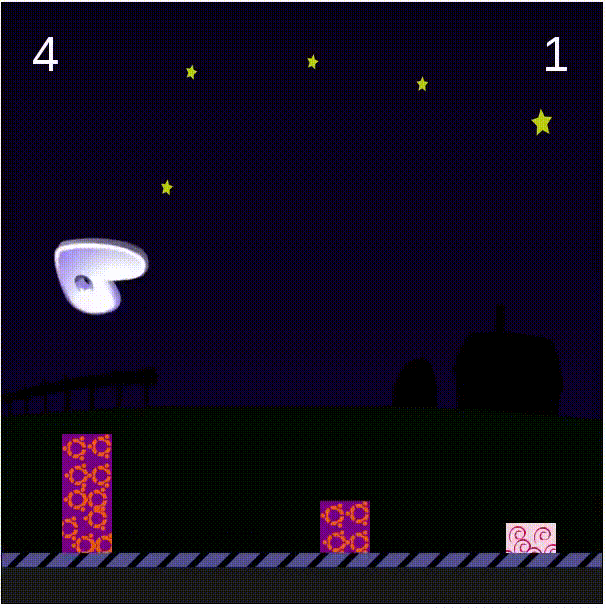

# gentoojumpgame
# Gentoo Jump Game
<https://www.youtube.com/TerminalRootTV>

> Game escrito em Javascript

## Instalação

git clone https://github.com/terminalrootsh/gentoojumpgame.git

cd gentoojumpgame

firefox index.html # foi criado e testado no Firefox 52.4.0 (32-bit)

# Inscreva-se no nosso Canal:
# <https://www.youtube.com/TerminalRootTV>

Siga-nos aqui no GitHub!

_Esse Game foi baseado no jogo do Felipe Alves_
